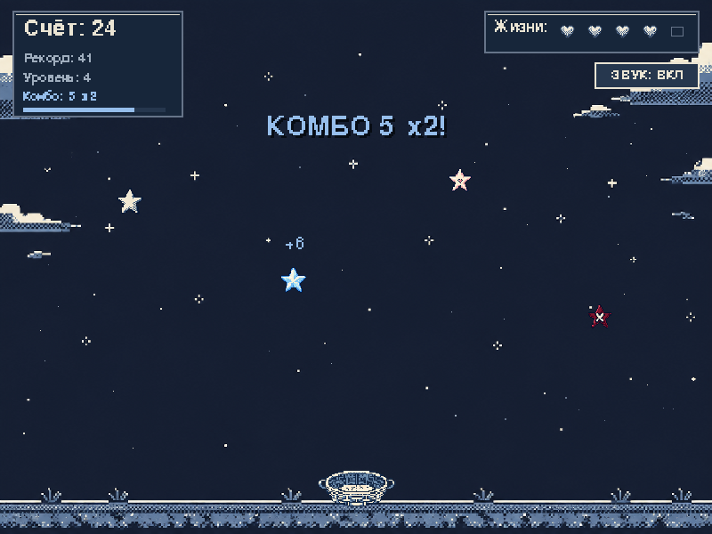
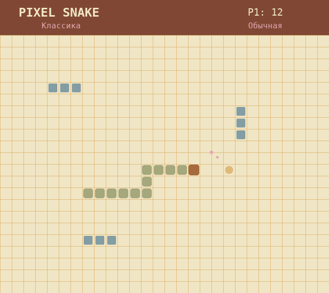

<div align="center">

# Python Mini Projects 🐍🎮

### Небольшая коллекция пиксельных игр на Python

Учебные проекты, в которых я практикую игровую логику, интерфейсы, анимации, сохранение результатов и работу с **Pygame**.

[](https://www.python.org/)
[](https://www.pygame.org/)
[](https://pyga.me/)
[](#-проекты)
[](snake_game/LICENSE)

</div>

---

## 🎮 Проекты

### ⭐ Лови звёзды

Пиксельная аркада: двигай корзину, собирай полезные звёзды, поддерживай комбо и не попадайся на опасные.

<p align="center">
  
</p>

**Что есть в игре:**

- четыре вида звёзд: обычная, бонусная `+3`, дополнительная жизнь и опасная;
- комбо-множитель `×2`, частицы и всплывающие очки;
- три уровня сложности и постепенное ускорение;
- предупреждение о появлении новой звезды;
- стартовый отсчёт, пауза, звуки и полноэкранный режим;
- сохранение рекорда и подробная статистика после игры;
- адаптивное масштабирование окна без искажения пропорций.

**Управление:** `←` `→` или `A` `D` — движение · `P` — пауза · `M` — звук · `F11` — весь экран

[Открыть проект](catch-the-stars/) · [Подробная инструкция](catch-the-stars/README.md)

---

### 🐍 Pixel Snake Deluxe

Расширенная версия классической «Змейки» с несколькими режимами, препятствиями, бонусами и цветовыми темами.

<p align="center">
  
</p>

**Что есть в игре:**

- режимы «Классика», «Сквозь стены», «На время» и «Два игрока»;
- три уровня сложности;
- препятствия и ускорение по мере роста счёта;
- обычное яблоко, золотой бонус `+3` и замедляющая ягода;
- темы Clover, Cyber и Game Boy;
- звуки, фоновая мелодия и пиксельные частицы;
- таблица пяти лучших результатов с именем и датой.

**Управление:** стрелки — первый игрок · `WASD` — второй игрок · `Пробел` — пауза · `Esc` — меню

[Открыть проект](snake_game/) · [Подробная инструкция](snake_game/README.md)

---

## 🚀 Быстрый запуск

Требуется **Python 3.10 или новее**. Скачай репозиторий или клонируй его:

```bash
git clone https://github.com/ulmaskulovaira-collab/python-mini-projects.git
cd python-mini-projects
```

### Лови звёзды

```powershell
cd catch-the-stars
py -m pip install -r requirements.txt
py main.py
```

### Pixel Snake Deluxe

```powershell
cd snake_game
py -m pip install -r requirements.txt
py main.py
```

> Зависимости устанавливаются отдельно внутри папки каждой игры.

## 📁 Структура репозитория

```text
python-mini-projects/
├── catch-the-stars/       # Аркада «Лови звёзды»
│   ├── assets/            # Фон и игровые спрайты
│   ├── main.py
│   ├── README.md
│   └── requirements.txt
├── snake_game/            # Pixel Snake Deluxe
│   ├── main.py
│   ├── README.md
│   └── requirements.txt
├── docs/images/           # Скриншоты для главной страницы
└── README.md
```

## 🛠️ Что я практикую

`Python` · `Pygame` · игровые циклы · обработка столкновений · состояния игры · адаптивный интерфейс · пиксельная графика · звук · сохранение данных

## 🌱 В планах

- добавлять новые мини-игры;
- улучшать анимации и визуальные эффекты;
- собирать готовые `.exe`-версии для Windows;
- развивать меню, достижения и таблицы рекордов.

---

<div align="center">

Сделано с интересом к Python и пиксельным играм ✨

[Профиль автора](https://github.com/ulmaskulovaira-collab)

</div>
